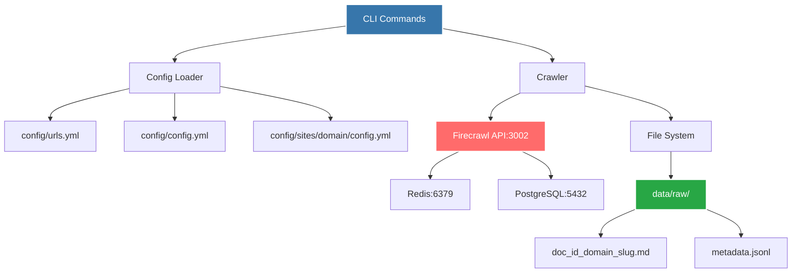
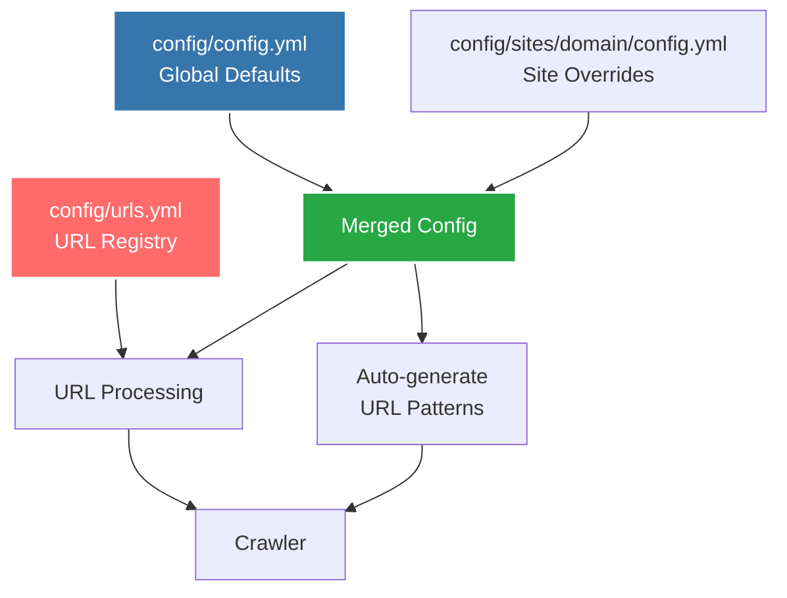
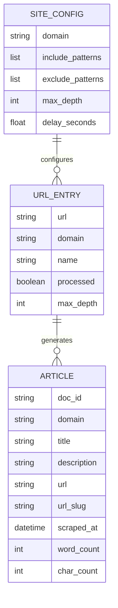
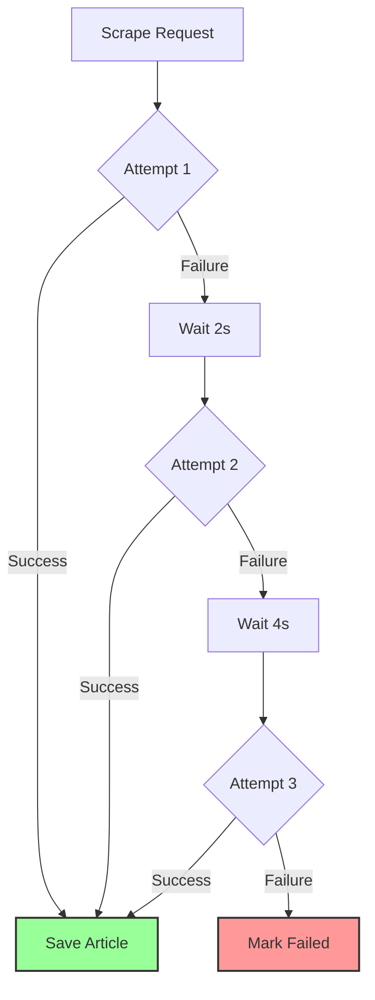

# Dominican LLM Scraper 🇩🇴

<div align="center">


**Production-Ready Multi-Domain Web Scraper for Dominican Spanish Content**

*Flexible, configuration-driven scraper supporting multiple domains with canonical logging, clean architecture, and automatic URL tracking*

</div>

## Platform Requirements

> **This application runs Firecrawl locally using Docker Compose - no API key required**

### System Architecture



## Dependencies

### Core Requirements

| Component | Version | Purpose |
|-----------|---------|---------|
| Docker | 20.10+ | Container runtime |
| Docker Compose | 2.0+ | Service orchestration |
| Python | 3.9+ | Runtime environment |
| uv | Latest | Fast Python package manager |
| firecrawl-py | 4.10+ | API client library |
| python-dotenv | 1.2+ | Environment variable management |
| pyyaml | 6.0+ | Configuration file parsing |

### Local Firecrawl Stack

The application runs Firecrawl locally via Docker using pre-built images:

| Service | Port | Purpose | Image Source |
|---------|------|---------|--------------|
| Firecrawl API | 3002 | Web scraping engine | ghcr.io/firecrawl/firecrawl:latest |
| Playwright | - | Browser automation | ghcr.io/firecrawl/playwright-service:latest |
| Redis | 6379 | Job queue management | redis:alpine |
| PostgreSQL | 5432 | Job state persistence | Built locally (custom schema) |

### Compatibility Matrix

```mermaid
gantt
    title Platform Support
    dateFormat X
    axisFormat %s
    
    section Operating Systems
    macOS     : 0, 1
    Linux     : 0, 1  
    Windows   : 0, 1
    
    section Python Versions
    Python 3.9  : 0, 1
    Python 3.10 : 0, 1
    Python 3.11 : 0, 1
    Python 3.12 : 0, 1
    Python 3.14 : 0, 1
```



## Installation & Setup

### Prerequisites

- **Docker** and **Docker Compose** installed ([Get Docker](https://docs.docker.com/get-docker/))
- **Python 3.9+**
- **uv** package manager ([Get uv](https://docs.astral.sh/uv/))
- **4GB RAM minimum** (8GB recommended)

### Quick Start

```bash
git clone https://github.com/lopezbec/cocina-dominicana-crawl_Dominican_LLM_project.git
cd cocina-dominicana-crawl_Dominican_LLM_project

make setup

make test

make scrape

make firecrawl-stop
```

### Installation Flowchart

```mermaid
flowchart LR
    A[Clone Repository] --> B[Install uv]
    B --> C[Run make setup]
    C --> D[Install Python deps]
    D --> E[Initialize Firecrawl]
    E --> F[Build PostgreSQL]
    F --> G[Start Services]
    G --> H[Verify with make test]
    H --> I[Ready to Scrape]
    
    style A fill:#ff69b4,stroke:#333,stroke-width:2px
    style I fill:#9f9,stroke:#333,stroke-width:2px
```



### Detailed Setup

#### Step 1: Clone Repository

```bash
git clone https://github.com/lopezbec/cocina-dominicana-crawl_Dominican_LLM_project.git
cd cocina-dominicana-crawl_Dominican_LLM_project
```

#### Step 2: Install uv Package Manager

```bash
# macOS/Linux
curl -LsSf https://astral.sh/uv/install.sh | sh

# Or use Homebrew
brew install uv

# Windows
powershell -c "irm https://astral.sh/uv/install.ps1 | iex"
```

#### Step 3: Run Complete Setup

```bash
make setup
```

This command will:
- Sync Python dependencies using uv
- Initialize Firecrawl directory structure
- Pull pre-built Docker images
- Build PostgreSQL service (~30 seconds)
- Start all services (API, Redis, PostgreSQL, Playwright)

#### Step 4: Verify Services

```bash
make test
```

Expected: JSON response with scraped content from example.com

#### Step 5: Run Scraper

```bash
make scrape
```

This processes all unprocessed URLs from `config/urls.yml` and marks them as processed automatically.

#### Step 6: Stop Services When Done

```bash
make firecrawl-stop
```

### Makefile Commands

View all available commands:

```bash
make help
```

Common commands:

| Command | Description |
|---------|-------------|
| `make setup` | Complete first-time setup |
| `make install` | Install Python dependencies |
| `make firecrawl-start` | Start Firecrawl services |
| `make firecrawl-stop` | Stop Firecrawl services |
| `make firecrawl-restart` | Restart all services |
| `make firecrawl-status` | Show service status |
| `make firecrawl-logs` | Follow API logs |
| `make scrape` | Process all unprocessed URLs from config/urls.yml |
| `make scrape-url URL=<url>` | Scrape a single URL |
| `make scrape-file FILE=<file>` | Scrape URLs from custom YAML file |
| `make scrape-force` | Reprocess all URLs (ignores processed status) |
| `make process` | Process markdown to plain text |
| `make test` | Test Firecrawl endpoint |
| `make clean` | Remove scraped content |
| `make clean-all` | Remove everything including Firecrawl |
| `make setup-site DOMAIN=<domain>` | Create new site configuration |
| `make list-sites` | List configured sites |

## Features

Production-ready multi-domain scraper with enterprise-grade reliability:

### Core Capabilities

- **Multi-Domain Support**: Scrape multiple websites with domain-specific configurations. Currently configured for 4 domains: cocinadominicana.com, librosdominicanos.com, poesiadominicana.jmarcano.com, and los-poetas.com
- **Centralized URL Management**: Single `config/urls.yml` file manages all URLs across all domains with automatic tracking
- **Automatic Processing State**: URLs are automatically marked as processed after successful scraping
- **Smart Resume Capability**: Automatically skips already-scraped URLs unless `--force` flag is used
- **Domain Auto-Detection**: System automatically detects domain from URLs - no environment variables needed
- **Configuration Hierarchy**: Global defaults with domain-specific overrides for maximum flexibility
- **Auto-Generated URL Patterns**: Extraction patterns automatically generated from base_url
- **Local Firecrawl**: No API keys, no rate limits, full control over scraping infrastructure
- **Flexible Scraping Modes**: Process config files, scrape direct URLs, or batch process custom files
- **Canonical Logging**: Structured logging following Stripe's canonical log pattern
- **Clean Architecture**: Functions follow Single Responsibility Principle, functions ≤30 lines
- **Performance Monitoring**: Built-in timing for all operations
- **Robust Error Handling**: Comprehensive exception handling with exponential backoff retry
- **File Organization**: Domain-aware filename generation with global sequential doc IDs
- **Docker-based**: Easy setup with docker-compose, no complex configuration
- **CLI Interface**: User-friendly command-line interface with multiple operation modes
- **YAML Configuration**: Easy site setup and customization with merge semantics

### Configuration Architecture



### Data Model



## Usage

### Command-Line Interface

The scraper provides a flexible CLI for different scraping scenarios. Domain detection is automatic - no environment variables required.

#### Process All Unprocessed URLs

Scrape all URLs from `config/urls.yml` that haven't been processed yet:

```bash
make scrape
# Or directly:
uv run python -m dominican_llm_scraper scrape
```

The system automatically:
- Reads `config/urls.yml`
- Filters to unprocessed URLs (`processed: false`)
- Scrapes each URL with discovery
- Marks URLs as `processed: true` after successful scraping
- Skips URLs already marked as processed

#### Reprocess All URLs

Force reprocess all URLs, ignoring processed status:

```bash
make scrape-force
# Or directly:
uv run python -m dominican_llm_scraper scrape --force
```

This is useful for:
- Updating existing content
- Testing configuration changes
- Recovering from partial failures

#### Scrape Specific URLs

Scrape one or more URLs directly without using config files:

```bash
make scrape-url URL="https://www.cocinadominicana.com/batata-asada"
# Or directly:
uv run python -m dominican_llm_scraper scrape https://www.cocinadominicana.com/batata-asada

# Multiple URLs:
uv run python -m dominican_llm_scraper scrape https://example.com/page1 https://example.com/page2
```

Domain is automatically detected from the URL and appropriate site configuration is loaded.

#### Scrape from Custom File

Create a custom YAML file with URLs and scrape from it:

```bash
# Create custom file
cat > custom_urls.yml << EOF
urls:
  - url: https://www.cocinadominicana.com/batata-asada
    domain: cocinadominicana.com
    name: Custom Recipe
    processed: false
    max_depth: 2
EOF

# Scrape from custom file
make scrape-file FILE=custom_urls.yml
# Or directly:
uv run python -m dominican_llm_scraper scrape --urls-file custom_urls.yml
```

#### Scrape Without Updating Config

Scrape URLs without marking them as processed:

```bash
uv run python -m dominican_llm_scraper scrape https://example.com/page --no-update
```

Useful for testing or one-off scraping without affecting the URL registry.

#### Process to Plain Text

Convert scraped markdown to plain text:

```bash
make process
# Or directly:
uv run python -m dominican_llm_scraper process
```

### CLI Commands Reference

| Command | Description | Example |
|---------|-------------|---------|
| `scrape` | Process URLs from config/urls.yml | `uv run python -m dominican_llm_scraper scrape` |
| `scrape <urls>` | Scrape specific URLs | `uv run python -m dominican_llm_scraper scrape <url1> <url2>` |
| `scrape --urls-file` | Scrape from custom YAML file | `uv run python -m dominican_llm_scraper scrape --urls-file file.yml` |
| `scrape --force` | Reprocess all URLs | `uv run python -m dominican_llm_scraper scrape --force` |
| `scrape --no-update` | Don't update processed status | `uv run python -m dominican_llm_scraper scrape <url> --no-update` |
| `process` | Process markdown to plaintext | `uv run python -m dominican_llm_scraper process` |

### Configuration

The scraper uses a hierarchical configuration system with three levels:

#### 1. Global Configuration (`config/config.yml`)

Default settings for all sites:

```yaml
output_dir: data/raw
plaintext_output_dir: data/processed

crawler:
  max_depth: 2
  delay_seconds: 5
  skip_existing: true
  max_retries: 3
  base_retry_delay: 2

filters:
  exclude_patterns:
    - wp-content
    - wp-json
    - \.(jpg|jpeg|png|gif)$
    - facebook\.com
    - instagram\.com

processing:
  filter_english: true
  min_content_length: 100
  navigation_patterns:
    - "Suscríbete.*para recibir.*"
    - "Síguenos en:.*"
  footer_markers:
    - "Suscríbete para recibir"
```

#### 2. URL Registry (`config/urls.yml`)

Centralized registry of all URLs to scrape across all domains:

```yaml
urls:
  - url: https://www.cocinadominicana.com/cultura/herencia
    domain: cocinadominicana.com
    name: Cultura y Orígenes
    processed: true
    max_depth: 2
  
  - url: https://www.cocinadominicana.com/recetas/postres
    domain: cocinadominicana.com
    name: Postres
    processed: false
    max_depth: 2
  
  - url: http://librosdominicanos.com/
    domain: librosdominicanos.com
    name: Libros Dominicanos
    processed: true
    max_depth: 2
```

**Fields:**
- `url`: Full URL to scrape (with protocol)
- `domain`: Domain name (without www)
- `name`: Descriptive name for logging
- `processed`: Boolean tracking if URL has been scraped
- `max_depth`: Maximum crawl depth for discovery

**Processing State Management:**

The system automatically updates the `processed` field:
- After successful scraping → `processed: true`
- Use `--force` to ignore processed status
- Use `--no-update` to prevent status updates

#### 3. Domain-Specific Configuration (`config/sites/{domain}/config.yml`)

Override defaults for specific domains:

```yaml
# config/sites/cocinadominicana_com/config.yml
filters:
  include_patterns:
    - cocinadominicana\.com/.*
  exclude_patterns:
    - suscribete
    - subscribe
    - contactanos

crawler:
  max_depth: 2
  delay_seconds: 5
  skip_existing: true
```

**Configuration Merging:**

Domain configs override global configs with smart merging:
- **Scalar values**: Domain overrides global
- **Lists**: Domain appends to global (merged)
- **Dicts**: Recursively merged

**Auto-Generated URL Patterns:**

The system automatically generates regex patterns for URL extraction based on the domain's `base_url`. No manual pattern configuration needed.

### Adding New Domains

#### Method 1: Using Template (Recommended)

```bash
make setup-site DOMAIN=example.com
```

This creates:
- `config/sites/example_com/config.yml` from template
- Pre-populated with common patterns

Then:
1. Add URLs to `config/urls.yml`
2. Customize `config/sites/example_com/config.yml` if needed
3. Run: `make scrape`

#### Method 2: Manual Setup

1. Create domain directory:

```bash
mkdir -p config/sites/example_com
```

2. Create `config/sites/example_com/config.yml`:

```yaml
filters:
  include_patterns:
    - example\.com/.*
  exclude_patterns:
    - subscribe
    - contact

crawler:
  delay_seconds: 1.0
  max_depth: 2
```

3. Add URLs to `config/urls.yml`:

```yaml
urls:
  - url: https://example.com/category
    domain: example.com
    name: Category Name
    processed: false
    max_depth: 2
```

4. Run scraper:

```bash
make scrape
```

### Programmatic Usage

```python
from dominican_llm_scraper.core.config_loader import load_config, load_urls_config
from dominican_llm_scraper.core.crawler import Crawler

# Load configuration for specific domain (auto-detects from URL)
config = load_config("https://www.cocinadominicana.com/recetas")

# Or load by domain name
config = load_config("cocinadominicana.com")

# Initialize crawler
crawler = Crawler(config)

# Scrape single URL
article_data = crawler.scrape_url("https://www.cocinadominicana.com/batata-asada")

# Crawl with discovery
result = crawler.crawl_category(
    category_url="https://www.cocinadominicana.com/recetas/postres",
    base_url="https://www.cocinadominicana.com",
    category_name="postres",
    max_depth=2
)

print(f"Discovered: {result['urls_discovered']}")
print(f"Scraped: {result['articles_scraped']}")

# Load all URLs from config
urls = load_urls_config()
for url_entry in urls:
    if not url_entry.get("processed"):
        print(f"Unprocessed: {url_entry['url']}")
```

## Output Structure

```
data/raw/
├── 0001_cocinadominicana_com_batata-asada.md
├── 0002_cocinadominicana_com_mangu.md
├── 0003_librosdominicanos_com_libro-historia.md
├── 0042_poesiadominicana_jmarcano_com_poeta-123.md
├── metadata.jsonl
└── scraping_summary.json
```

### Filename Format

Files are named with a global sequential document ID and domain:

```
{doc_id}_{domain_slug}_{url_slug}.md
```

**Examples:**
- `0001_cocinadominicana_com_batata-asada.md`
- `0042_librosdominicanos_com_getting-started.md`
- `0127_poesiadominicana_jmarcano_com_poema-titulo.md`

**Document ID Assignment:**
- Sequential across all domains
- Starts at 0001
- Automatically incremented
- Never reused

### File Formats

#### Markdown Files (`.md`)

Each scraped article is saved with YAML frontmatter:

```markdown
---
doc_id: 1020
domain: cocinadominicana.com
title: "Batata Asada al Horno"
description: "Receta tradicional dominicana de batata asada"
url: https://www.cocinadominicana.com/batata-asada
scraped_at: 2025-01-15T14:15:30.123456
word_count: 450
char_count: 2847
---

# Batata Asada al Horno

Article markdown content here...
```

#### Metadata JSONL (`metadata.jsonl`)

Each line is a JSON object for one article:

```json
{"doc_id": "1020", "domain": "cocinadominicana.com", "title": "Batata Asada al Horno", "description": "Receta tradicional dominicana de batata asada", "url": "https://www.cocinadominicana.com/batata-asada", "url_slug": "batata-asada", "scraped_at": "2025-01-15T14:15:30.123456", "word_count": 450, "char_count": 2847}
```

**Use cases:**
- Bulk analysis with tools like `jq`
- Database imports
- Statistical analysis
- Content indexing

## Logging and Monitoring

### Canonical Log Pattern

The scraper implements structured logging with canonical log lines for excellent observability:

#### Session Tracking

```
2025-01-15T14:15:30 [INFO] dominican_llm_scraper.core.crawler: firecrawl_initialized api_url="http://localhost:3002"
2025-01-15T14:15:30 [INFO] dominican_llm_scraper.core.crawler: single_url_scrape_started url="https://www.cocinadominicana.com/batata-asada"
2025-01-15T14:15:31 [INFO] dominican_llm_scraper.core.crawler: article_scrape_completed url="https://..." title="Batata Asada" word_count=450
```

#### Performance Monitoring

```
2025-01-15T14:15:31 [INFO] dominican_llm_scraper.core.crawler: scrape_success url="https://..." attempt=1
2025-01-15T14:15:31 [INFO] dominican_llm_scraper.core.crawler: article_save_completed file_name="1020_cocinadominicana_com_batata-asada.md"
```

#### Error Tracking

```
2025-01-15T14:15:32 [ERROR] dominican_llm_scraper.core.crawler: scrape_error url="https://..." attempt=1 error="Connection timeout"
2025-01-15T14:15:34 [INFO] dominican_llm_scraper.core.crawler: scrape_success url="https://..." attempt=2
```

#### URL Discovery

```
2025-01-15T14:15:35 [INFO] dominican_llm_scraper.core.crawler: url_discovery_started section_url="https://..."
2025-01-15T14:15:36 [INFO] dominican_llm_scraper.core.crawler: url_discovery_completed section_url="https://..." urls_found=25
```

### Docker Service Logs

View logs for specific services:

```bash
# Firecrawl API logs
cd firecrawl && docker-compose logs -f firecrawl-api

# Redis logs
cd firecrawl && docker-compose logs -f redis

# PostgreSQL logs
cd firecrawl && docker-compose logs -f postgres

# All services
cd firecrawl && docker-compose logs -f
```

### Log Files

- **Console Output**: Real-time logging to terminal
- **Structured Format**: Machine-readable logs for monitoring tools
- **Docker Logs**: Service logs via `docker-compose logs`

## Performance Tuning

### Worker Configuration

Edit `firecrawl/.env` to adjust scraping speed:

```bash
NUM_WORKERS_PER_QUEUE=8
```

| Workers | Speed | Resource Usage | Use Case |
|---------|-------|----------------|----------|
| 4 | Slow | Low | Limited resources |
| 8 | Normal | Medium | Default, balanced |
| 16 | Fast | High | Good hardware |
| 32 | Very Fast | Very High | Server-grade |

After changes:
```bash
cd firecrawl && docker-compose restart firecrawl-api
```

## Reliability

### Error Recovery



**Features:**
- 3 retry attempts with exponential backoff (2s, 4s, 8s)
- Graceful handling of network timeouts
- Comprehensive error logging with context
- Resume capability for interrupted sessions
- Automatic skip of already-processed URLs

## Development

### Code Architecture

The codebase follows Clean Code principles with a modular structure:

```
src/dominican_llm_scraper/
├── cli/
│   └── commands.py           # Command-line interface
├── core/
│   ├── config_loader.py      # Configuration management
│   ├── crawler.py            # Web scraping logic
│   ├── processor.py          # Post-processing
│   ├── logging_config.py     # Logging setup
│   └── log_context.py        # Correlation IDs
└── utils/
    ├── logging.py            # Canonical logging
    └── file_utils.py         # File utilities

config/
├── config.yml                # Global defaults
├── urls.yml                  # URL registry with tracking
└── sites/
    ├── cocinadominicana_com/
    │   └── config.yml        # Site-specific overrides
    ├── librosdominicanos_com/
    │   └── config.yml
    └── ...

templates/
└── site_config.yml           # Template for new sites
```

### Design Principles

- **Single Responsibility**: Each module has one clear purpose, functions ≤30 lines
- **Configuration-Driven**: Site behavior controlled via YAML with merge semantics
- **Automatic Domain Detection**: No environment variables needed, domain extracted from URLs
- **Separation of Concerns**: Clear boundaries between config, crawling, and processing
- **Type Safety**: Full type annotations throughout
- **Canonical Logging**: Structured logs with correlation IDs for request tracing

### Testing

```bash
# Validate syntax
uv run python -m py_compile src/dominican_llm_scraper/**/*.py

# Run tests
uv run pytest

# Run with coverage
uv run pytest --cov=src/dominican_llm_scraper

# Test specific module
uv run pytest tests/core/test_config_loader.py

# Lint with ruff
uv run ruff check src/

# Format with ruff
uv run ruff format src/

# Test scraping single URL
uv run python -m dominican_llm_scraper scrape https://www.cocinadominicana.com/batata-asada
```

## Contributing

1. Fork the repository
2. Create a feature branch (`git checkout -b feature/amazing-feature`)
3. Follow Clean Code principles (functions ≤30 lines)
4. Add canonical logging for new operations
5. Update type annotations
6. Test your changes thoroughly
7. Commit with conventional commit format
8. Push and create a Pull Request

### Commit Format

```bash
git commit -m "feat: add multi-domain URL discovery

- Implement automatic domain detection from URLs
- Add centralized URL tracking in config/urls.yml
- Include processed status management
- Add canonical logging for discovery operations"
```

## Troubleshooting

### Common Issues

**Services Won't Start**

```
ERROR: Cannot connect to Docker daemon
```

**Solution**: Start Docker Desktop and ensure it's running

```bash
docker info
cd firecrawl && docker-compose logs -f

# Or restart services
cd firecrawl && docker-compose down -v && docker-compose up -d
```

**API Not Responding**

```
Error: Connection refused on localhost:3002
```

**Solution**: Verify Firecrawl is running

```bash
curl http://localhost:3002/test

# If no response, restart
cd firecrawl && docker-compose restart firecrawl-api
```

**Port Already in Use**

```
ERROR: Port 3002 is already allocated
```

**Solution**: Edit `firecrawl/docker-compose.yml` and change port mappings:

```yaml
ports:
  - "3003:3002"  # Changed from 3002:3002
```

**Import Errors**

```
ModuleNotFoundError: No module named 'yaml'
```

**Solution**: Sync dependencies with `uv sync` or `make setup`

```bash
uv sync
```

**No URLs to Process**

```
No URLs to process (all marked as processed)
```

**Solution**: Use `--force` flag to reprocess all URLs

```bash
make scrape-force
# Or:
uv run python -m dominican_llm_scraper scrape --force
```

**URLs Not Getting Marked as Processed**

**Solution**: Check that you're not using `--no-update` flag

```bash
# This will update processed status:
uv run python -m dominican_llm_scraper scrape

# This will NOT update processed status:
uv run python -m dominican_llm_scraper scrape --no-update
```

### Debug Mode

Enable verbose logging:

```python
import logging
import os

# Set debug level via environment
os.environ["LOG_LEVEL"] = "DEBUG"

# Then use standard logger (after setup_logging() is called)
logger = logging.getLogger(__name__)
```
## License

This project is for educational and research purposes. Please respect the website's robots.txt and terms of service.

## Support

- **Issues**: [GitHub Issues](https://github.com/lopezbec/cocina-dominicana-crawl_Dominican_LLM_project/issues)
- **Documentation**: This README
- **Repository**: [https://github.com/lopezbec/cocina-dominicana-crawl_Dominican_LLM_project](https://github.com/lopezbec/cocina-dominicana-crawl_Dominican_LLM_project)

## Acknowledgment

This project has been partially supported by the Ministerio de Educación Superior, Ciencia y Tecnología (MESCyT) of the Dominican Republic through the FONDOCYT grant. The authors gratefully acknowledge this support.

Any opinions, findings, conclusions, or recommendations expressed in this material are those of the authors and do not necessarily reflect the views of MESCyT.

---

**Built for preserving Dominican culinary culture and linguistic heritage**
